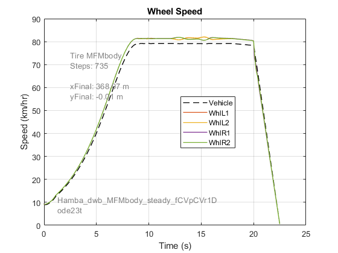
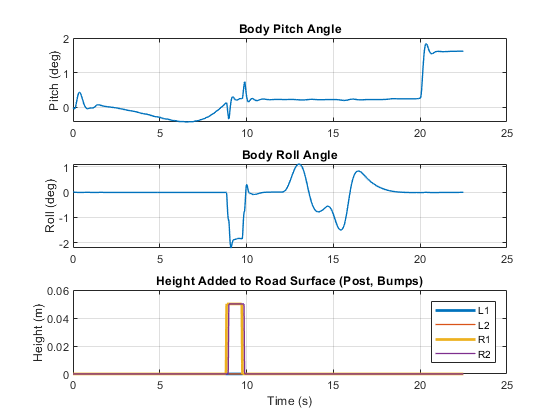
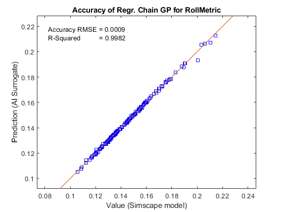
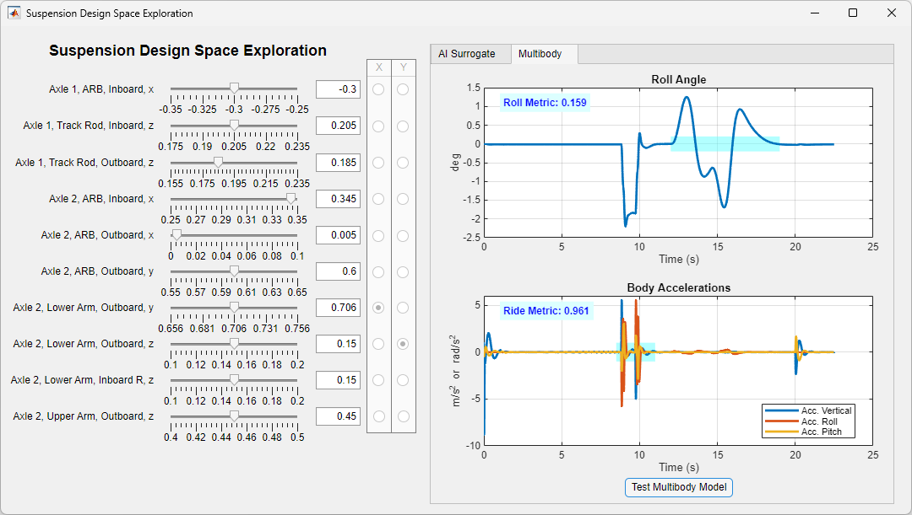

# **Optimizing Vehicle Design Using AI and Simscape&trade;**
Copyright 2024 The MathWorks, Inc.

This example shows the workflow to create a surrogate AI model using 
training data from a multibody model of a vehicle. The resulting AI 
model can be used for design space exploration and for finding 
the optimal design parameters.

* **Early-stage physical physical design** is supported by creating a reduced order model to rapidly evaluate hardpoint locations.
* **Sensitivity analysis** is supported by running many simulations in parallel and analyzing the influence of design parameters on performance metrics
* **Training data** for the AI model is produced using Design of Experiments to ensure the entire design spaces is covered.
* **Machine Learning and Deep Learning** are both used to create surrogate models that are automatically validated against the generated data.
* **Optimization algorithms** are used to identify the set of design parameters that balance the tradeoff between multiple performance metrics.
* A **MATLAB App** enables exploration of the design space using responses surfaces.

Open the project file SSVT_Susp_Opt.prj to get started.

## **Vehicle Model**

**Simscape Multibody is used to model the vehicle**.  The multibody model has 
**94 parameters defining the front and rear suspensions** which can be tuned.
This includes hardpoint locations, spring stiffnesses, and damping coefficients.
The parameter **values can be varied without recompiling the model** so that
parameter sweeps can be run as efficiently as possible.

## **Create Virtual Test with Performance Metric**

The virtual test used to evaluate the performance of the design has 
three stages to measure three performance metrics.  

1. **Ride Metric**: Drive over a bump and **measure pitch, roll, and vertical acceleration**
2. **Roll Metric**: Complete a double-lane change maneuver (ISO 3888) and **measure roll angle**
3. **Braking Metric**: Brake to a stop and **measure braking distance**
 
The simulation results below show the measurements taken to 
determine the performance metrics.

## **Identify Key Parameters For Design**
**Design of Experiments is used to generate parameter sets that cover the entire design 
space**. The model is simulated with those parameters and performance metrics are 
calculated. Statistical methods are used to **identify the relative sensitivities** of each 
performance metric to each parameter.

The plot below shows the 10 parameters identified as most influential.  **Reducing the 
design space from 94 to 10 parameters** accelerates the process of generating the surrogate AI model.

## **Generate Training Data by Running DoE**
**Design of Experiments** is used to generate parameter sets that **distribute the parameters 
evenly throughout the reduced design space** covered by the parameters with the largest
influence on our performance metrics. The scatter plot below shows the parameter sets generated 
for our Design of Experiments and the distribution of performance metrics.

## **Train and Validate AI Surrogate Model**
Training data is used to **train surrogate AI models**. After the models are 
trained, we **assess the accuracy of each model using the test data**. We compare 
the performance metric predicted by the trained model against the true value from 
the original Simscape simulation. The plot below shows **how the predictions compare
with the ground truth simluation results** as well as the error. The most accurate models 
will be used for the following steps of the workflow.

## **Optimize Design Using Surrogate Model**
To accelerate the optimization, AI surrogate models will be used. The AI 
surrogate models are loaded from a file. The **models can predict a performance 
metric based on the design parameters**. The function call to obtain the 
prediction from the AI surrogate model is added to the optimization variable 
which already has the design parameters and constraints.

The **optimization is performed using five different objectives** that use 
the roll metric, ride metric, or both. The resulting parameters are tested in 
the full simulation model to see the improvement in performance.  The plot below 
shows the results from the full simulation model for each of the five optimizations
and the default parameters.

## **Explore Design Space Using Surrogate Model**
A **MATLAB App** has been created using App Designer. When the AI Surrogate tab 
is selected, a **response surface is plotted**. Sliders allow the user to adjust 
the values of certain parameters. The response surface shows how sensitive a 
performance metric is to the selected parameters. **Two of the parameters are swept 
over the design space**
 while the other parameters are held at user-selected fixed values. 

When the Multibody tab is selected, the App lets you **run the simulation model** 
using a single set of parameter values defined in the App. The plots show the values 
for the performance metrics as well as the transient simulation results.  

To learn more about vehicle modeling and simulation with Simscape, please visit [Simscape Vehicle Templates](https://www.mathworks.com/solutions/physical-modeling/simscape-vehicle-templates.html).

* See also:
   * [Simscape&trade;](https://www.mathworks.com/products/simscape.html)
   * [Simscape Driveline&trade;](https://www.mathworks.com/products/simscape-driveline.html)
   * [Simscape Multibody&trade;](https://www.mathworks.com/products/simscape-multibody.html)
   * [Automated Driving Toolbox&trade;](https://www.mathworks.com/products/automated-driving.html)   
   * [Powertrain Blockset&trade;](https://www.mathworks.com/products/powertrain.html)   
   * [Parallel Computing Toolbox&trade;](https://www.mathworks.com/products/parallel-computing.html)
   * [Deep Learning Toolbox&trade;](https://www.mathworks.com/products/deep-learning.html)
   * [Statistics and Machine Learning Toolbox&trade;](https://www.mathworks.com/products/statistics.html)
   * [Optimization Toolbox&trade;](https://www.mathworks.com/products/optimization.html)
   * [Global Optimization Toolbox&trade;](https://www.mathworks.com/products/global-optimization.html)
   * [Simulink Design Optimization&trade;](https://www.mathworks.com/products/sl-design-optimization.html)   
   